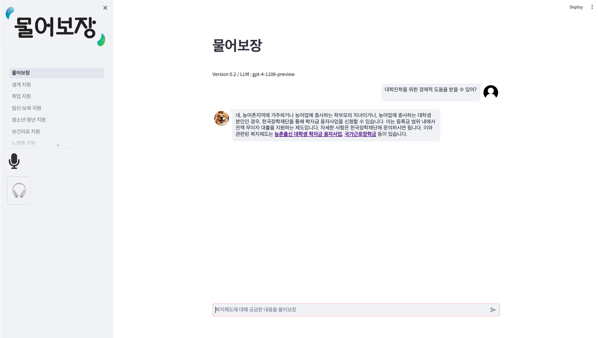

    
    
<b>개인 맞춤형 복지제도 매칭/제공 서비스 '물어보장'</b>

# Introduction

- **Project Title** : 생성형AI를 활용한 나에게 힘이 되는 AI복지 서비스 개발 프로젝트
- **Project Period** : 2023.10.20. ~ 2023.12.01. (6 Week)
- **Project Tag** : `LLM` `Openai` `RAG` `LangChain` `VectorDB` `Semantic Search` `ChatBot`
- **Partner Institution** : SSiS(한국사회보장정보원)

# How to Run

*(※ Please Check Your OpenAI API Key on your OS environment !!!)*  

    $ pip install -r requirements.txt
    $ cd app
    $ streamlit run 물어보장.py

# Contributor
<table>
  <tr>
    <!-- first -->
    <td align="center">
      <a href="https://github.com/ash-hun">
         
        <b>최재훈</b>
      </a>
    </td>
    <!-- second -->
    <td align="center">
      <a href="https://github.com/Noveled">
         
        <b>김민식</b>
      </a>
    </td>
  </tr>
</table>

# Tools

  

# Reference

- [**LangChain**](https://python.langchain.com/docs/get_started/introduction)
- [**AI factory : 회사내규 챗봇 직접 만들어보기 tutorial**](https://aifactory.space/task/2446/overview)
- [**PDF 문서기반 질의응답 챗봇 만들기 tutorial**](https://aifactory.space/task/2461/overview)
- [**Domain Adaptation과 Fine-Tuning의 차이**](https://yangoos57.github.io/blog/DeepLearning/paper/Finetuning/Finetuning/)
